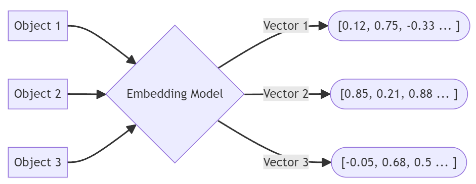

  
  

With the advent of LLMs, manual tagging and classification have become obsolete. This project simplifies text classification by leveraging embeddings and similarity scoring to categorize data efficiently. The primary use case here is for home renovation, where receipts or text descriptions of expenses need to be classified into categories such as kitchen, bathroom, living room, driveway, or yard.

The approach involves the following steps:

- **Embedding Storage**: Generate and store vector embeddings for predefined categories.
- **Text Processing**: Convert the given text into an embedding representation.
- **Cosine Similarity Matching**: Compare the text embedding against stored category embeddings.
- **Category Assignment**: Assign the text to the category with the highest similarity score.

This setup ensures a scalable, efficient, and automated classification process without the need for complex model training. By simply updating or modifying the predefined categories, the system remains flexible and adaptable to various classification needs.

Replicate or read more [here](https://github.com/thap2331/hybrid_search_with_recency){:target="_blank" rel="noopener"}.